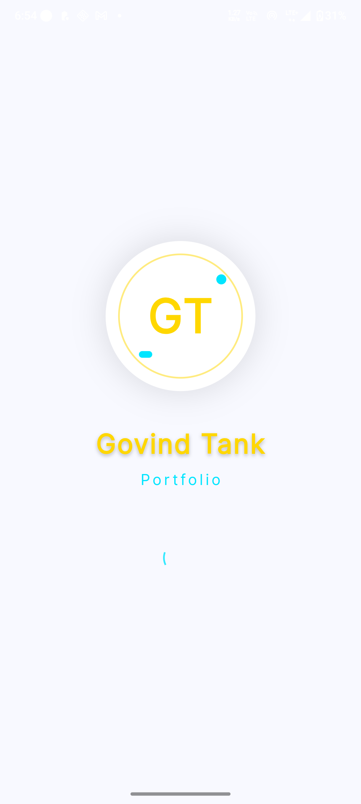
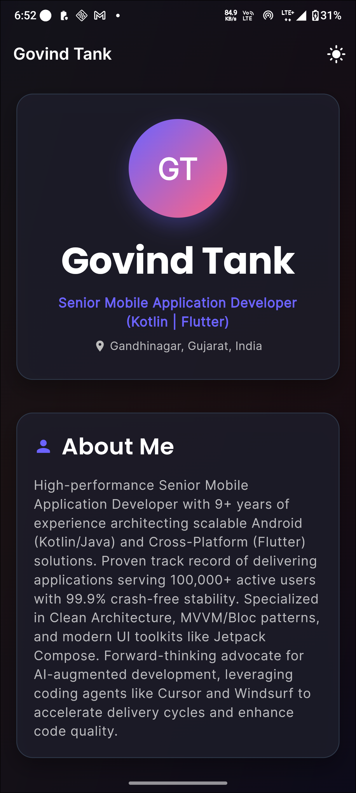
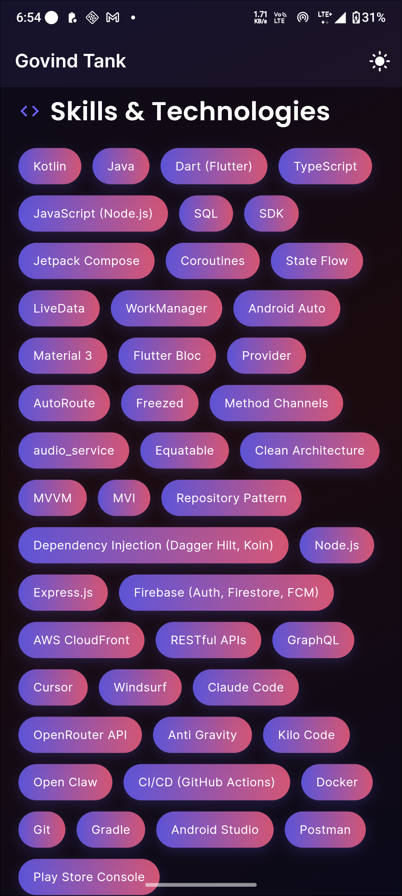
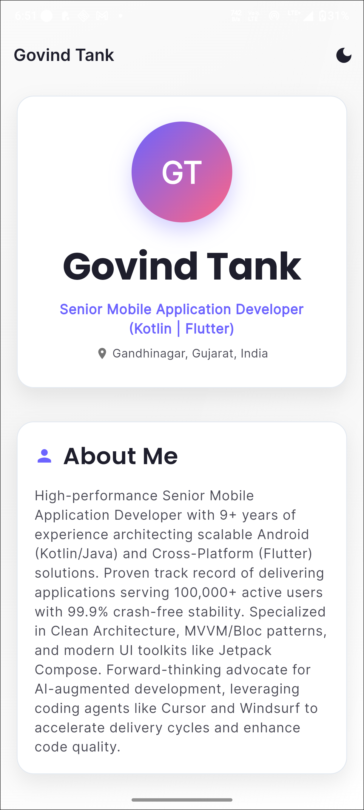
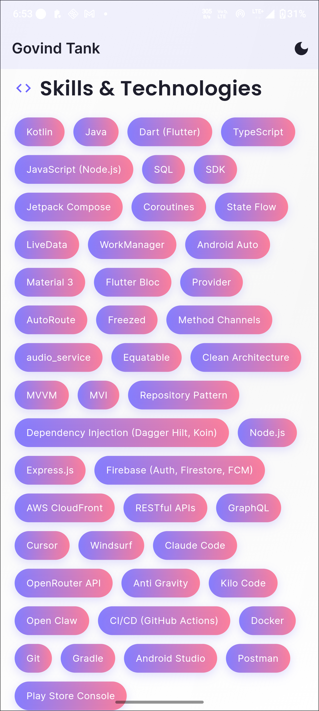
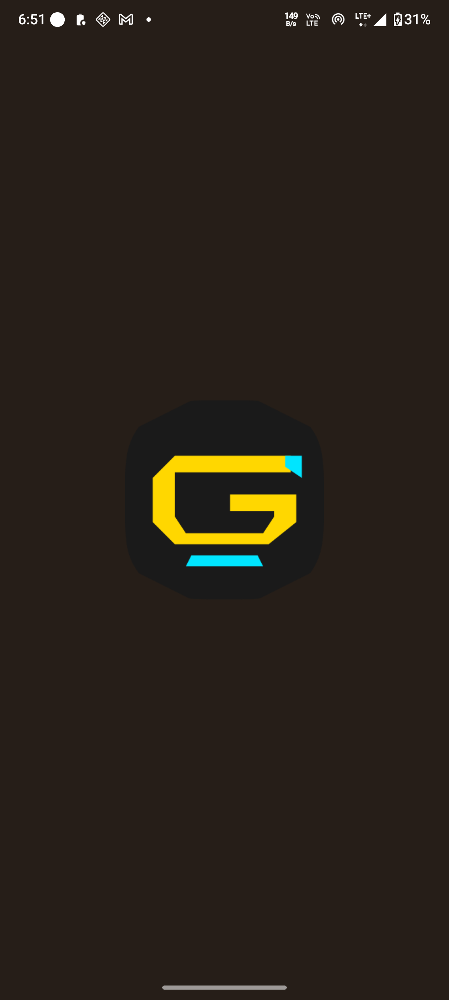
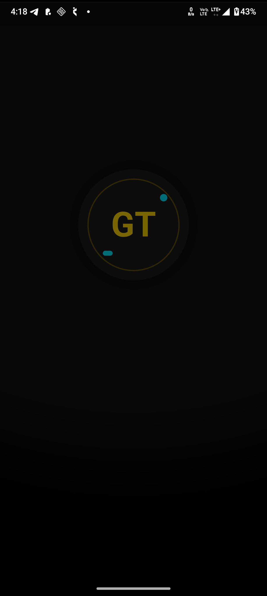
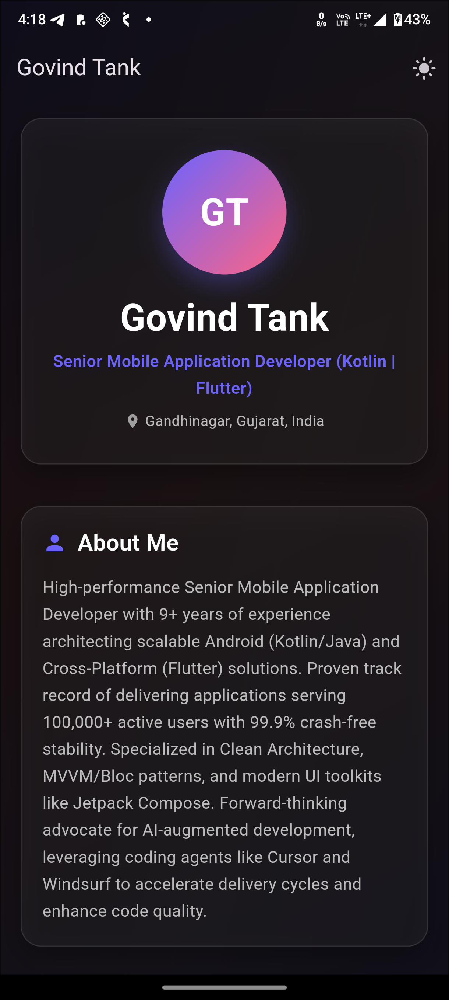
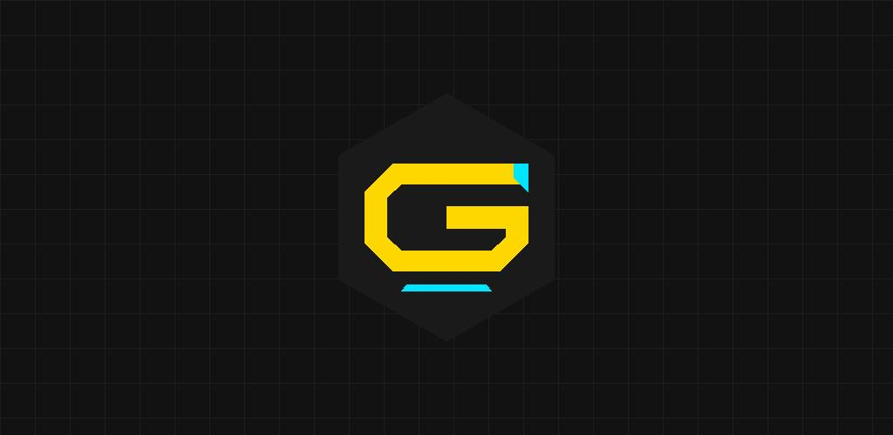

# Portfolio App

A professional Flutter portfolio application showcasing your work and skills.

## 🎨 Features

- **Professional GT Logo** - Custom designed logo with dark theme, gold, and cyan accents
- **Animated Splash Screen** - Smooth animations on app launch
- **Edge-to-Edge Display** - Full-screen experience on modern devices
- **Portrait & Landscape Support** - Seamless orientation switching
- **API Level 36** - Latest Android compatibility
- **16KB Page Size** - Optimized for modern Android devices
- **Resume Display** - Beautiful resume display with PDF download option
- **Visitor Counter** - Tracks daily unique visitors

## 📱 App Screenshots

### 🎨 App Logo
<div align="center">
  
</div>

### 🌟 App Preview

<div align="center">

#### 🚀 Splash Screen


#### 🌙 Dark Theme
<table>
  <tr>
    <td></td>
    <td></td>
  </tr>
</table>

#### ☀️ Light Theme
<table>
  <tr>
    <td></td>
    <td></td>
  </tr>
</table>

#### 📱 Additional Screens
<table>
  <tr>
    <td></td>
    <td></td>
  </tr>
  <tr>
    <td></td>
    <td></td>
  </tr>
</table>

</div>

### ✨ Key Features Showcased

- **🎨 Professional Design**: Modern, clean interface with custom GT logo
- **🌙 Dark Mode Support**: Beautiful dark theme with gold and cyan accents
- **☀️ Light Mode**: Clean and bright interface for daytime usage
- **🚀 Animated Splash**: Smooth and engaging app launch experience
- **📱 Responsive Layout**: Optimized for various screen sizes and orientations
- **🎯 User-Friendly**: Intuitive navigation and professional presentation

## 🚀 Getting Started

### Prerequisites

- Flutter SDK 3.24.0 or higher
- Android SDK with API 36
- Git

### Installation

1. Clone the repository:
   ```bash
   git clone https://github.com/govindtank/portfolioApp.git
   cd portfolio
   ```

2. Install dependencies:
   ```bash
   flutter pub get
   ```

3. Run the app:
   ```bash
   flutter run
   ```

## 🔧 Building the App

### Debug Build (For Testing)

**Using PowerShell Script:**
```powershell
.\build_debug.ps1
```

**Manual Build:**
```bash
flutter build apk --debug
```

The debug APK will be located at:
```
build/app/outputs/flutter-apk/app-debug.apk
```

### Release Build (For Play Store)

1. Create a signing keystore:
   ```bash
   keytool -genkey -v -storetype JKS -keyalg RSA -keysize 2048 -validity 10000 -keystore android/release.jks -alias portfolio
   ```

2. Configure signing:
   - Copy `android/key.properties.template` to `android/key.properties`
   - Fill in your keystore details

3. Build release APK:
   ```bash
   flutter build apk --release
   ```

The release APK will be located at:
```
build/app/outputs/flutter-apk/app-release.apk
```

## 📋 Privacy Policy

The privacy policy for this app is hosted on GitHub Pages:

**URL:** https://govindtank.github.io/portfolioApp/privacy_policy.html

The privacy policy covers:
- Data collection and usage
- Third-party services
- User rights and choices
- Contact information
- Policy updates

## 🧪 Testing

For comprehensive testing instructions, see [TESTING.md](TESTING.md).

### Quick Test

1. Build debug APK:
   ```bash
   flutter build apk --debug
   ```

2. Install on device:
   ```bash
   flutter install
   ```

3. Test all features and functionality

## 📦 GitHub Actions

This project uses GitHub Actions for automated builds:

- **Debug APK** - Built on every push and pull request
- **Release APK** - Built on main branch (requires keystore secrets)
- **Privacy Policy** - Automatically deployed to GitHub Pages
- **Flutter Web** - Automatically built and deployed to GitHub Pages

### Download Artifacts

1. Go to the [Actions tab](https://github.com/govindtank/portfolioApp/actions)
2. Click on a completed workflow run
3. Download artifacts from the workflow run

## 🎯 Play Store Submission

### Before Submitting

- [ ] Complete all testing (see [TESTING.md](TESTING.md))
- [ ] Create app icon (512x512)
- [ ] Create feature graphic (1024x500)
- [ ] Take screenshots (minimum 2, 1080x1920)
- [ ] Write app description
- [ ] Create signing keystore
- [ ] Build release APK
- [ ] Verify privacy policy URL


## 🛠️ Tech Stack

- **Framework:** Flutter 3.24.0
- **Language:** Dart
- **Target SDK:** Android API 36
- **Min SDK:** Android API 23
- **Architecture:** Clean Architecture

## 📁 Project Structure

```
portfolio/
├── android/                 # Android-specific code
│   ├── app/
│   │   ├── src/main/
│   │   │   ├── res/        # Resources (drawables, layouts)
│   │   │   └── AndroidManifest.xml
│   │   └── build.gradle    # Android build configuration
│   └── key.properties.template
├── assets/                  # App assets
│   ├── animations/         # Lottie animations
│   ├── icons/              # App icons
│   ├── images/             # Images
│   └── resume/             # Resume files
├── lib/                     # Dart source code
│   ├── main.dart           # App entry point
│   └── screens/            # App screens
├── .github/workflows/      # CI/CD workflows
├── build_debug.ps1         # Debug build script
├── build_release.ps1       # Release build script
├── privacy_policy.html     # Privacy policy
├── TESTING.md              # Testing guide
└── PLAY_STORE_LISTING.md   # Play Store listing guide
```

## 🔐 Security

- Keystore files are never committed to the repository
- Use `android/key.properties` for local development
- Store keystore secrets in GitHub repository secrets for CI/CD

## 📝 License

This project is licensed under the MIT License.

## 👤 Author

**Govind Tank**

- GitHub: [@govindtank](https://github.com/govindtank)

## 🤝 Contributing

Contributions, issues, and feature requests are welcome!

## 📞 Support

For support, email govindtank600@gmail.com or open an issue in the repository.

---

**Built with ❤️ using Flutter**
